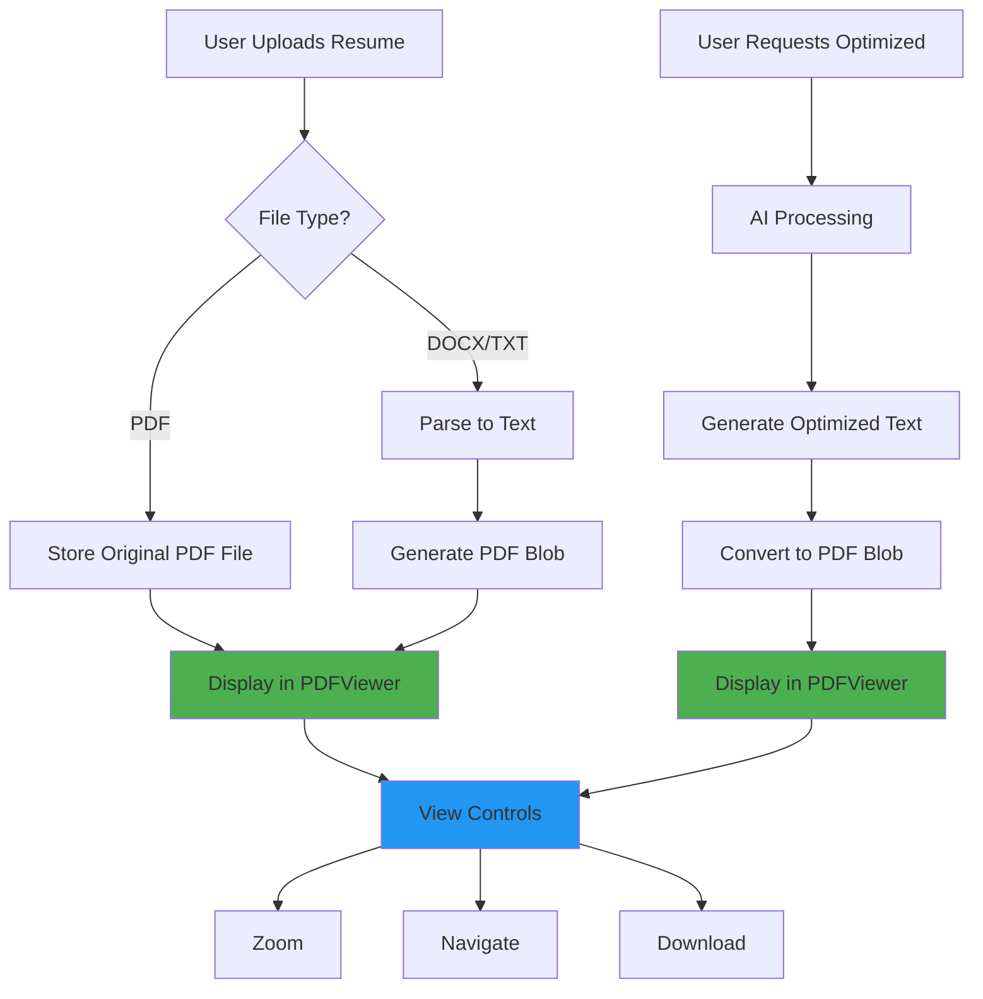
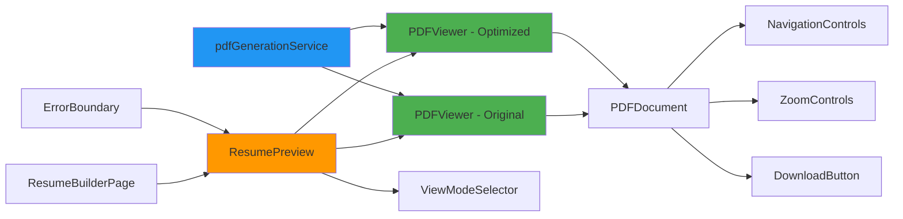
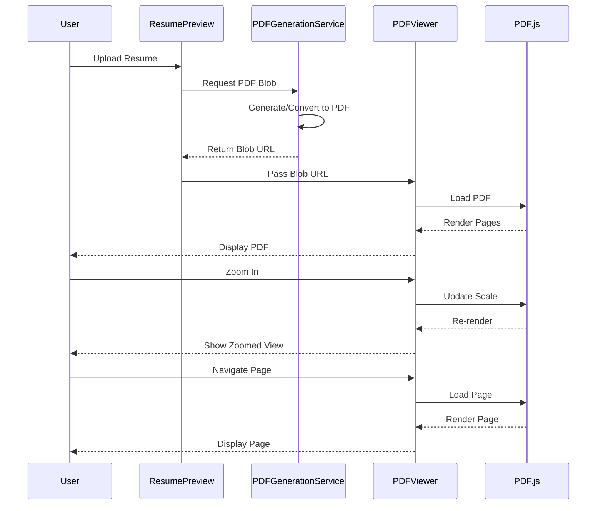
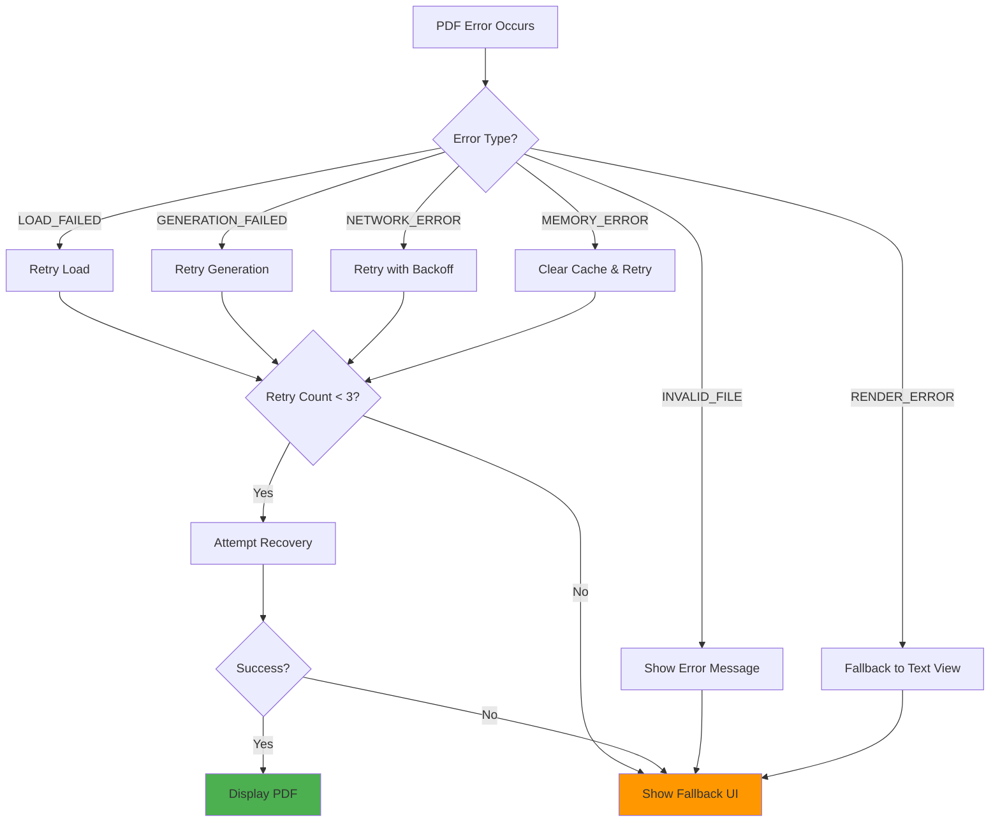

# PDF Viewer Enhancement - Technical Specification

## Architecture Overview

### System Flow Diagram



### Component Architecture



### Data Flow



## Component Specifications

### 1. PDFViewer Component

#### Props Interface
```typescript
interface PDFViewerProps {
  // PDF Source (one required)
  pdfUrl?: string;              // Blob URL or remote URL
  pdfFile?: File;               // Direct File object
  pdfData?: Uint8Array;         // Raw PDF data
  
  // Display Options
  title: string;                // Header title
  subtitle?: string;            // Optional subtitle
  badge?: {                     // Optional badge
    text: string;
    color: 'blue' | 'green' | 'purple' | 'yellow';
  };
  
  // Behavior
  initialScale?: number;        // Default: 1.0 (100%)
  initialPage?: number;         // Default: 1
  enableDownload?: boolean;     // Default: true
  enableZoom?: boolean;         // Default: true
  enableNavigation?: boolean;   // Default: true
  
  // Callbacks
  onLoadSuccess?: (pdf: PDFDocumentProxy) => void;
  onLoadError?: (error: Error) => void;
  onPageChange?: (page: number) => void;
  onZoomChange?: (scale: number) => void;
  
  // Styling
  className?: string;
  height?: string | number;     // Default: '700px'
}
```

#### State Management
```typescript
interface PDFViewerState {
  numPages: number | null;
  currentPage: number;
  scale: number;
  isLoading: boolean;
  error: string | null;
  retryCount: number;
}
```

#### Key Features
1. **Zoom Levels**: 25%, 50%, 75%, 100%, 125%, 150%, 200%
2. **Navigation**: Previous, Next, Jump to Page
3. **Keyboard Shortcuts**:
   - Arrow Left/Right: Navigate pages
   - +/-: Zoom in/out
   - 0: Reset zoom to 100%
   - Home/End: First/Last page
4. **Touch Gestures**: Pinch to zoom (mobile)
5. **Loading States**: Skeleton screen during load
6. **Error Handling**: Retry button, fallback message

### 2. PDFGenerationService

#### API Interface
```typescript
interface PDFGenerationService {
  // Generate PDF from resume data
  generateResumePDF(
    data: ParsedResumeData,
    type: 'original' | 'optimized',
    options?: PDFGenerationOptions
  ): Promise<Blob>;
  
  // Convert text to PDF
  textToPDF(
    content: string,
    metadata: PDFMetadata
  ): Promise<Blob>;
  
  // Create blob URL for display
  createBlobUrl(blob: Blob): string;
  
  // Cleanup blob URL
  revokeBlobUrl(url: string): void;
  
  // Download PDF
  downloadPDF(
    blob: Blob,
    filename: string
  ): void;
}

interface PDFGenerationOptions {
  fontSize?: number;            // Default: 11
  fontFamily?: string;          // Default: 'Helvetica'
  lineHeight?: number;          // Default: 1.5
  margins?: {                   // Default: 40
    top: number;
    right: number;
    bottom: number;
    left: number;
  };
  pageSize?: 'A4' | 'Letter';  // Default: 'A4'
  orientation?: 'portrait' | 'landscape'; // Default: 'portrait'
}

interface PDFMetadata {
  title: string;
  author?: string;
  subject?: string;
  keywords?: string[];
  creator?: string;
}
```

#### Implementation Strategy
```typescript
// Using jsPDF for text-to-PDF conversion
import { jsPDF } from 'jspdf';

export async function textToPDF(
  content: string,
  metadata: PDFMetadata
): Promise<Blob> {
  const doc = new jsPDF({
    orientation: 'portrait',
    unit: 'pt',
    format: 'a4'
  });
  
  // Set metadata
  doc.setProperties({
    title: metadata.title,
    author: metadata.author || 'IBM Watsonx Resume Builder',
    subject: metadata.subject || 'Professional Resume',
    keywords: metadata.keywords?.join(', ') || '',
    creator: metadata.creator || 'IBM Watsonx AI'
  });
  
  // Configure text styling
  doc.setFont('helvetica');
  doc.setFontSize(11);
  
  // Split content into lines and pages
  const lines = doc.splitTextToSize(content, 515); // A4 width - margins
  let y = 40; // Top margin
  
  lines.forEach((line: string) => {
    if (y > 800) { // Near bottom of page
      doc.addPage();
      y = 40;
    }
    doc.text(line, 40, y);
    y += 16; // Line height
  });
  
  // Return as blob
  return doc.output('blob');
}
```

### 3. Enhanced ResumePreview Component

#### State Management
```typescript
interface ResumePreviewState {
  // PDF URLs
  originalPdfUrl: string | null;
  optimizedPdfUrl: string | null;
  
  // Original file (if uploaded as PDF)
  originalPdfFile: File | null;
  
  // Generation state
  isGeneratingOriginal: boolean;
  isGeneratingOptimized: boolean;
  
  // Error state
  originalError: string | null;
  optimizedError: string | null;
  
  // View mode
  viewMode: 'split' | 'original' | 'optimized';
}
```

#### Lifecycle Hooks
```typescript
// Generate PDFs on mount or data change
useEffect(() => {
  if (originalResume && !originalPdfUrl) {
    generateOriginalPDF();
  }
}, [originalResume]);

useEffect(() => {
  if (generatedResume && !optimizedPdfUrl) {
    generateOptimizedPDF();
  }
}, [generatedResume]);

// Cleanup blob URLs on unmount
useEffect(() => {
  return () => {
    if (originalPdfUrl) {
      pdfGenerationService.revokeBlobUrl(originalPdfUrl);
    }
    if (optimizedPdfUrl) {
      pdfGenerationService.revokeBlobUrl(optimizedPdfUrl);
    }
  };
}, [originalPdfUrl, optimizedPdfUrl]);
```

## Error Handling Strategy

### Error Types and Recovery

```typescript
enum PDFErrorType {
  LOAD_FAILED = 'LOAD_FAILED',
  GENERATION_FAILED = 'GENERATION_FAILED',
  INVALID_FILE = 'INVALID_FILE',
  NETWORK_ERROR = 'NETWORK_ERROR',
  RENDER_ERROR = 'RENDER_ERROR',
  MEMORY_ERROR = 'MEMORY_ERROR'
}

interface PDFError {
  type: PDFErrorType;
  message: string;
  recoverable: boolean;
  retryAction?: () => void;
  fallbackAction?: () => void;
}
```

### Error Recovery Flow



## Performance Optimization

### 1. Lazy Loading Strategy
```typescript
// Load pages on-demand
const [loadedPages, setLoadedPages] = useState<Set<number>>(new Set([1]));

const loadPage = useCallback((pageNum: number) => {
  if (!loadedPages.has(pageNum)) {
    setLoadedPages(prev => new Set([...prev, pageNum]));
  }
}, [loadedPages]);

// Preload adjacent pages
useEffect(() => {
  const preloadPages = [currentPage - 1, currentPage + 1]
    .filter(p => p > 0 && p <= numPages);
  
  preloadPages.forEach(loadPage);
}, [currentPage, numPages, loadPage]);
```

### 2. Caching Strategy
```typescript
// Cache generated PDFs
const pdfCache = new Map<string, Blob>();

async function getCachedPDF(key: string): Promise<Blob | null> {
  return pdfCache.get(key) || null;
}

async function setCachedPDF(key: string, blob: Blob): Promise<void> {
  pdfCache.set(key, blob);
  
  // Limit cache size (max 10 PDFs)
  if (pdfCache.size > 10) {
    const firstKey = pdfCache.keys().next().value;
    pdfCache.delete(firstKey);
  }
}
```

### 3. Memory Management
```typescript
// Track blob URLs for cleanup
const blobUrls = useRef<Set<string>>(new Set());

function createManagedBlobUrl(blob: Blob): string {
  const url = URL.createObjectURL(blob);
  blobUrls.current.add(url);
  return url;
}

function cleanupBlobUrls(): void {
  blobUrls.current.forEach(url => {
    URL.revokeObjectURL(url);
  });
  blobUrls.current.clear();
}

// Cleanup on unmount
useEffect(() => {
  return () => {
    cleanupBlobUrls();
  };
}, []);
```

## Responsive Design

### Breakpoints
```typescript
const breakpoints = {
  mobile: '0px',      // 0-639px
  tablet: '640px',    // 640-1023px
  desktop: '1024px',  // 1024px+
  wide: '1536px'      // 1536px+
};
```

### Layout Adaptations

#### Mobile (< 640px)
- Single column layout
- Stacked view mode selector
- Simplified controls (essential only)
- Touch-optimized buttons (min 44px)
- Reduced zoom levels (50%, 100%, 150%)

#### Tablet (640px - 1023px)
- Single column or side-by-side (landscape)
- Full controls visible
- Standard zoom levels
- Swipe gestures enabled

#### Desktop (1024px+)
- Side-by-side split view
- Full control panel
- All zoom levels available
- Keyboard shortcuts enabled

## Testing Strategy

### Unit Tests
```typescript
describe('PDFViewer', () => {
  it('should render PDF from URL', async () => {
    const { getByTestId } = render(
      <PDFViewer pdfUrl="test.pdf" title="Test" />
    );
    await waitFor(() => {
      expect(getByTestId('pdf-canvas')).toBeInTheDocument();
    });
  });
  
  it('should handle zoom controls', async () => {
    const { getByRole } = render(
      <PDFViewer pdfUrl="test.pdf" title="Test" />
    );
    const zoomIn = getByRole('button', { name: /zoom in/i });
    fireEvent.click(zoomIn);
    // Assert scale increased
  });
  
  it('should navigate pages', async () => {
    const onPageChange = jest.fn();
    const { getByRole } = render(
      <PDFViewer 
        pdfUrl="test.pdf" 
        title="Test"
        onPageChange={onPageChange}
      />
    );
    const nextButton = getByRole('button', { name: /next/i });
    fireEvent.click(nextButton);
    expect(onPageChange).toHaveBeenCalledWith(2);
  });
});
```

### Integration Tests
```typescript
describe('ResumePreview with PDFViewer', () => {
  it('should display original and optimized PDFs', async () => {
    const { getByText } = render(
      <ResumePreview
        originalResume={mockOriginal}
        generatedResume={mockGenerated}
        viewMode="split"
        onViewModeChange={jest.fn()}
      />
    );
    
    await waitFor(() => {
      expect(getByText('Original')).toBeInTheDocument();
      expect(getByText('Optimized')).toBeInTheDocument();
    });
  });
});
```

### E2E Tests
```typescript
describe('PDF Viewer E2E', () => {
  it('should complete full workflow', async () => {
    // Upload resume
    await uploadFile('resume.pdf');
    
    // Wait for processing
    await waitForElement('[data-testid="pdf-viewer"]');
    
    // Test zoom
    await click('[data-testid="zoom-in"]');
    await expectZoomLevel(125);
    
    // Test navigation
    await click('[data-testid="next-page"]');
    await expectPageNumber(2);
    
    // Test download
    await click('[data-testid="download-pdf"]');
    await expectDownloadStarted();
  });
});
```

## Security Considerations

### 1. File Validation
```typescript
function validatePDFFile(file: File): boolean {
  // Check file type
  if (!file.type.includes('pdf')) {
    throw new Error('Invalid file type');
  }
  
  // Check file size (max 10MB)
  if (file.size > 10 * 1024 * 1024) {
    throw new Error('File too large');
  }
  
  return true;
}
```

### 2. Content Security
- Sanitize PDF content before rendering
- Use Content Security Policy (CSP)
- Prevent XSS through PDF injection
- Validate PDF structure

### 3. Resource Limits
- Maximum file size: 10MB
- Maximum pages: 50
- Timeout for generation: 30 seconds
- Memory limit per PDF: 50MB

## Accessibility

### WCAG 2.1 AA Compliance
- Keyboard navigation support
- Screen reader announcements
- Focus management
- Color contrast ratios (4.5:1 minimum)
- Alternative text for controls
- ARIA labels and roles

### Keyboard Shortcuts
| Key | Action |
|-----|--------|
| ← → | Navigate pages |
| + - | Zoom in/out |
| 0 | Reset zoom |
| Home | First page |
| End | Last page |
| Space | Next page |
| Shift+Space | Previous page |

## Browser Compatibility

### Supported Browsers
- Chrome 90+ ✅
- Firefox 88+ ✅
- Safari 14+ ✅
- Edge 90+ ✅

### Polyfills Required
- None (PDF.js handles compatibility)

## Deployment Checklist

- [ ] Install dependencies
- [ ] Configure PDF.js worker
- [ ] Create PDFViewer component
- [ ] Create pdfGenerationService
- [ ] Update ResumePreview component
- [ ] Add error boundaries
- [ ] Implement responsive design
- [ ] Add loading states
- [ ] Write unit tests
- [ ] Write integration tests
- [ ] Test on all browsers
- [ ] Test on mobile devices
- [ ] Verify accessibility
- [ ] Update documentation
- [ ] Create commit message
- [ ] Submit for review

---

**Document Version**: 1.0
**Last Updated**: 2026-05-02
**Status**: Ready for Implementation